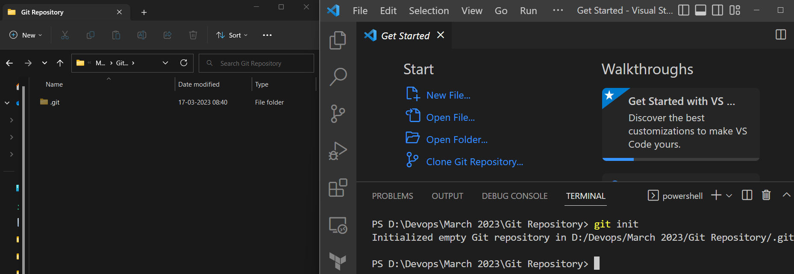
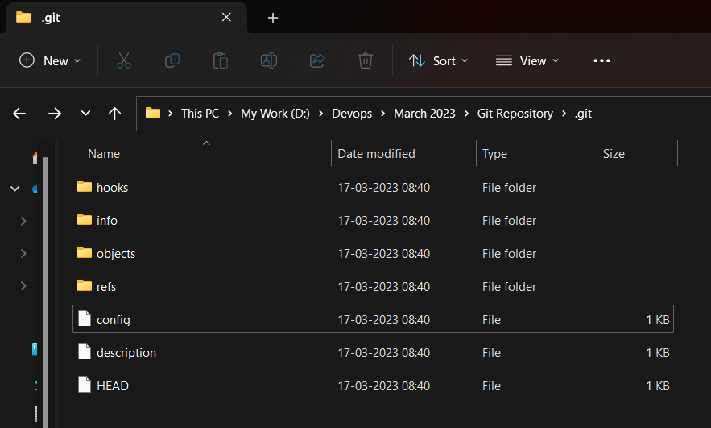
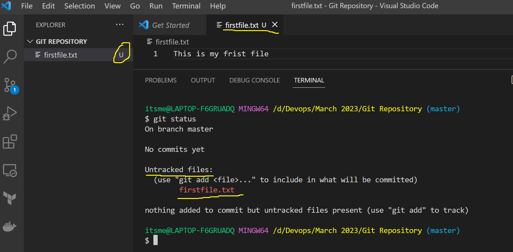
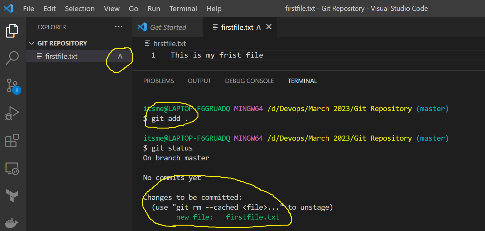
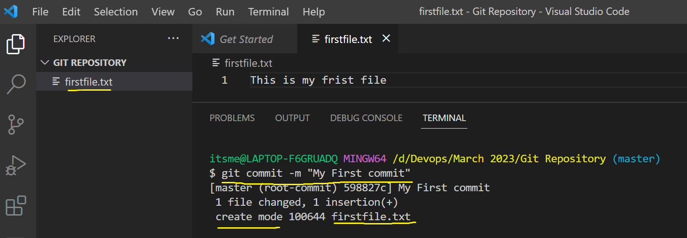

## Git Commands & Terms

**How to start using Git**
- When ever you are working on any repository first thing you have to do is *Initialize the Git*. 
- Then the next step is to *configure your credentials* to store the meta data.
- You can start working with git

**What are the steps included in git process**
- First Step : git clone / git pull
- Second Step: git add path
- Third Step : git commit <commit message>
- Fourth Step: git push


**What are the different terms in git**
- First One : Tracked Files
    - The files which are in Staging area and ready to commit or to move to local repository
- Second One: Untracked Files (U)
    - The files which are not in contact with staging are and ready to move to staging area
- Third One : Added (A)
    - The files which are freshly added in to our repository
- Fourth One: Modifid (M)
    - The files which are in track with our repository and made any changes to those files
- Fifth One : Deleted (D)
    - The files which are deleted from our repository


**Major terms in git**

- First One  : Branch
    - Branch is a place where you are mainting the code and it will be used to maintain parallel work with different tasks. By default when a repository is created *MASTER* branch will be the default one. You can rename the branch and can create another branch.
    - But we need to maintain all the code in a single branch that will be the *master/main* branch.
- Second One : Head
    - This is the place where your current commit or the branch is located. Usally Head will point to the latest commit in the branch
- Third One  : Commit
    - Commit is used to find out the changes or simply we can call it as Version.


Before Initializing the Git Repo in your local system. Make sure you have installed git in your local repository.\
Necessary Softwares required in our course\
- [Chocolatey](https://chocolatey.org/install)
- [Visual Studio Code](https://code.visualstudio.com/Download) 
- [Git](https://git-scm.com/download/win)
- [AWS Account](https://portal.aws.amazon.com/billing/signup?refid=ff721c0f-c85d-4643-817f-04fb0e8a7323&redirect_url=https%3A%2F%2Faws.amazon.com%2Fregistration-confirmation#/start/email)


**How to Initialize git in your local system**
- Go the place where you want to create git repository in your local system and then type the following command
```
git init
```
- Once you type the above command it will create a *.git* file in the path where you mentioned. It will contain all the details to make a folder as a tree.


- *.git* folder contains the following details


- Next process




