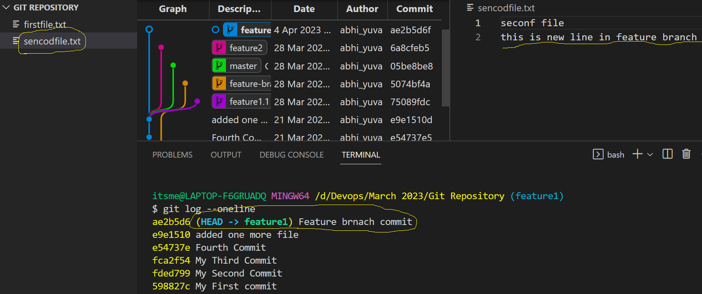
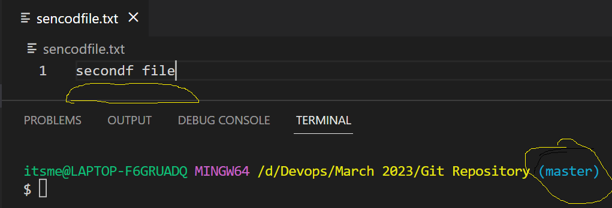
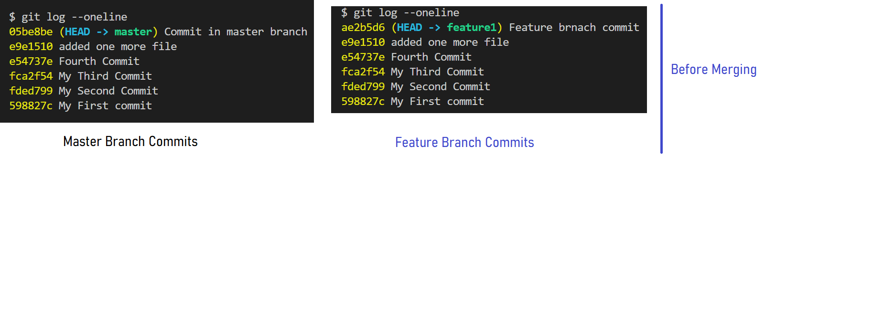
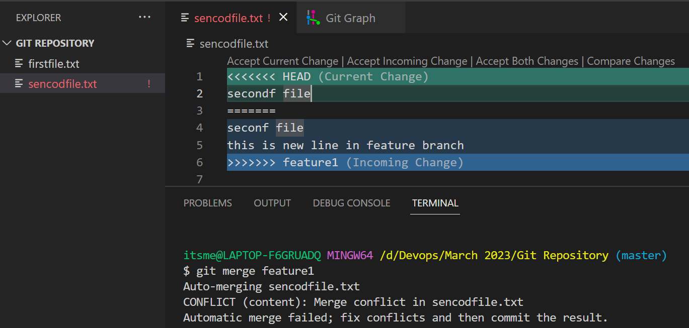
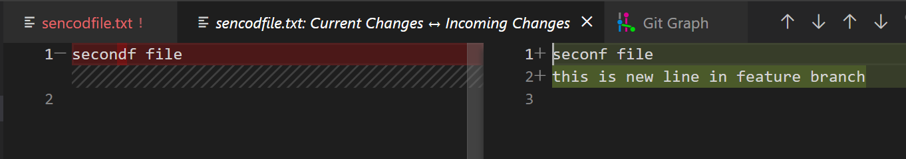

# Git Merge
- Once you get finalized code from your end and you have tested everything and all the changes were working proprley, then you are supposed to merge back the changes from your feature branch to the main branches.

**How to do Merging**
- When ever you want to merge back the changes from your feature branch to the main branch, you are supposed to pull the changes first and then try to merge the code.
- Once you merge the changes, you have to push back the changes to the remote repository from your local system.
- While merging there may be some conflicts in some situations happen. We have handle those conflicts and need to resolve it.
- You have to be in the target branch from the source where ever you want to merge

**Git Merge**
```
git merge <branch>

ex: you have to merge the changes from feature branch to master

Source: feature
Target: master

checkout to the Target Branch(Master)
now do git merge feature
```







