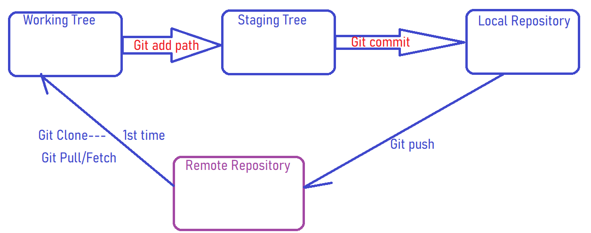
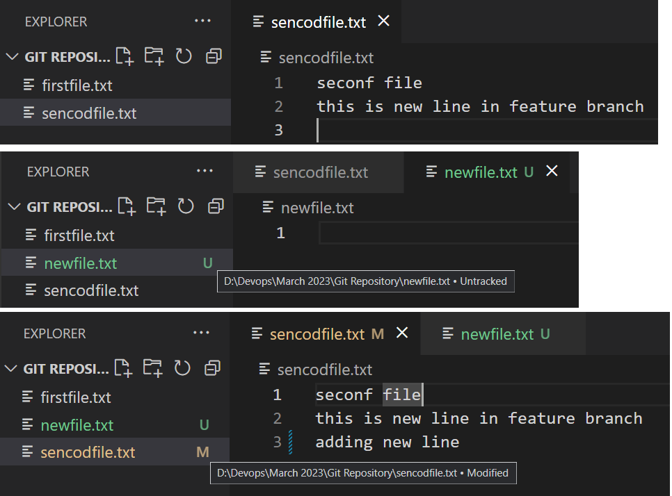
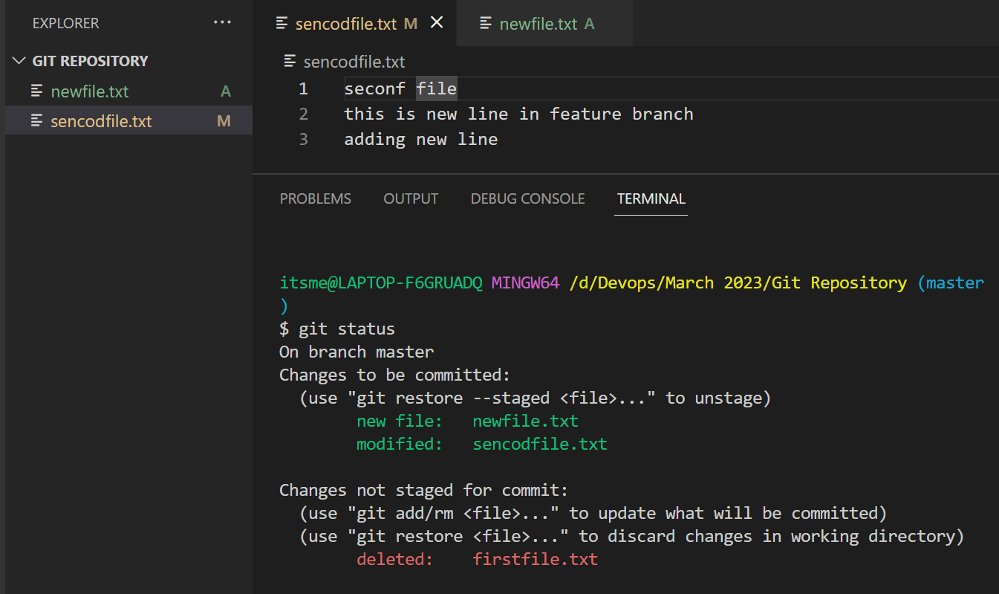
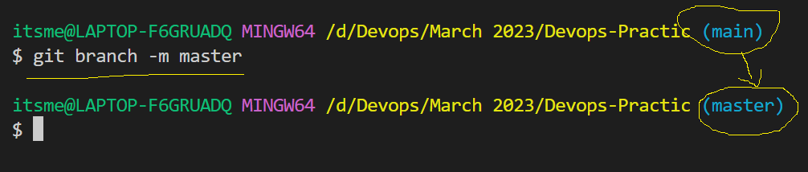
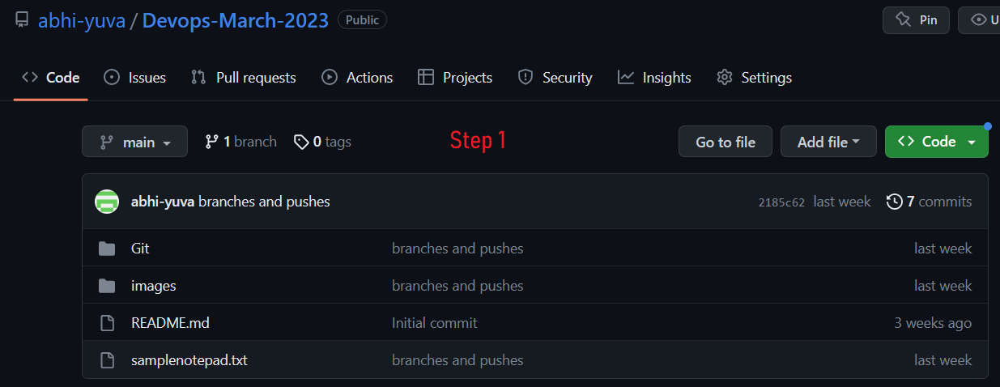
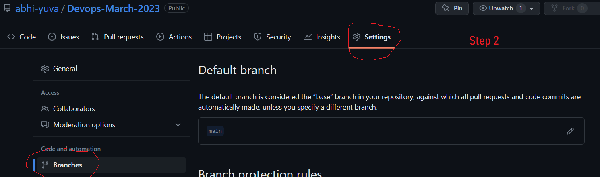
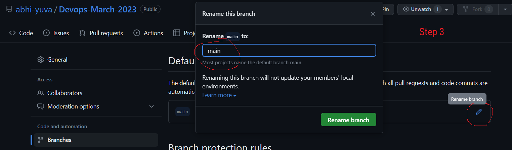
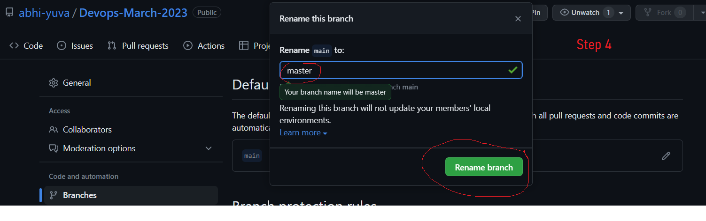
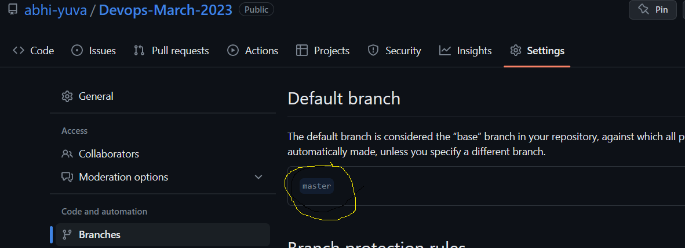

# How to identiy files in Git Repo

- The below things will make you understand on how to identify the files.
- What are the different files naming convenstions we have in git
    - Tracked - Which are added to your index list. When we do git add, the files will be in tracked list. These files will be in staging area.
    - Untracked(U) - The files which are newly added to the repository and yet to be added to your index list.
    - Added(A) - When you do git add for the untracked files, files will be changed from untracked to added.
    - Modified(M) - These are the files which are already in our tracked list and we added or modified the content freshly. Those files will be shown as Modifed (M).
    - Deleted(D) - These are files which are deleted from your list.

    
  
    

# How to modfiy the branch name.
- By default when we create a repository, branch name will be created with *Main*
- We have two way to modify the branch name.
    1. From cli(command line interface)
    ```
    git branch -m <new-branch-name>
    ```
    
    2. From GIT-GUI.\
        - Follow the belwo steps to modify the branch name from GUI.\
            - Go to Git Hub
            - Then, go to settings on your specific repository
            
            - Then, click on branches on left hand side
            
            - Then, click on Edit button on the branch name you wish you modify
            - Then, rename your branch and click on rename.
             
            - Finally your brnach name is modified
              
              
