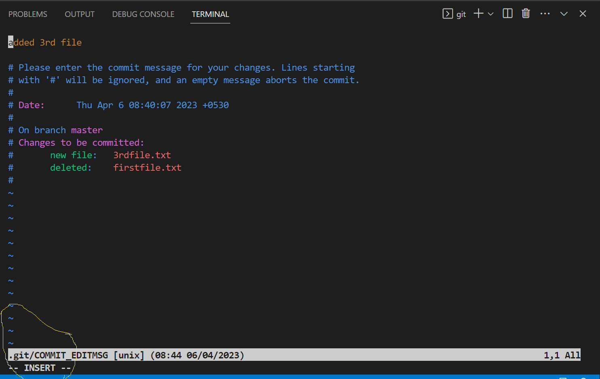

- How to Create PAT Token
    - PAT is nothing but a Personal Access Token.
    - To Create a PAT Token we have to follow the below steps.
- How to Create SSH Keys
    - Secure Shell
- How to Modify the commit message
    - After commit the message, if you wish to modify the commit message which was worngly written the command is
    ```
    git commit --amend
    ```
    - When you type the above command it will open an editor. Press *I* it will be in insert mode.
    
    - Then you can modify the commit message.
    - Then Press *ESC* and then type *:wq* and then press enter
    
    

- How to protect your branches
