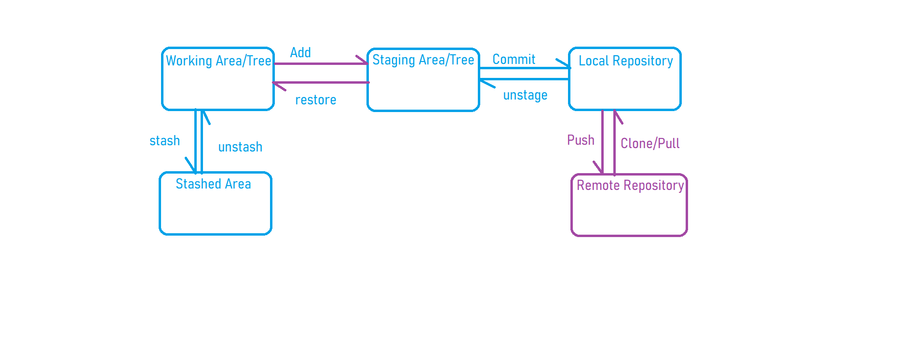

### Git Terms need to be familiear with

## How Repositories are maintained
Basically We can maintain repositories in 2 ways
- Self Hosted
    - We have to choose our servers
    - You have to install all the necessary softwared to maintain
    - Start executing the repositories work
    - Maintained by our own
- Cloud Hosted
    - No need to maintain servers from our side
    - We just need to create an account on any one of the cloud
    - Use it as per your requirement

# Different Types of Repositories
There are different types of repositories
- Code Repository
    - This we will be using it to maintain our code. Mostly it will be used by devlopers.\
    Examples:
        - GitHub
        - Gitlab
        - Bitbucket
        - Gitolite
        - AWS Code Commit
        - Azure 
- Artifactory Repository
    - It is nothing but, the package which will be generated at the time build process. We will store this in some place call it as artifactory repository
    Examples:
        - JFrog
        - Nexus
        - DockerHub
- Package Repository
    - It is basically related to the OS. To install any kind of softwares we will go with package repository to install easily.
    To use this we just need to run one command which will take of the remaining steps.\
    **Different types of Package Repositories**
    - Windows
        - chocolatey
    - Linux
        - Ubuntu OS
            - apt
        - CentOS
            - yum
        - Redhat
    - Mac
        - Homebrew

## Familiar with Git Terms
- What do you mean by Git
    * Git is a VCS/SCM which will contain all the repositories and will be maintained either in Self Hosted/ Cloud Hosted
    * Git will store the data along with the meta data
        - Username
            To find out who has created it or modified it.
        - Date & Time
            To find when it has created
        - Commit Message
            To know what it is used for or created for
        - Commit ID
            - For every Commit Message it will create unique commit id by the system itself. We can simply say this as a version.
            - We can move from one commit to another commit and can view the changes on that particular commit
            - when ever you modify change in one particular commit and after you save it. new commit will be create on top of it with the new changes or modifications.

## What are the different stages in Git
In Git we have 4 Stages
- Working Area/ Tree
    - It is the place where we are doing our changes or creations or what ever we do.
- Staging Area/ Tree
    - It is the place where all our changes are stored with some id.
- Stashed Area
    - It is a temporary place which can be used to keep your current work aside for some time. Late you can move back to your working or stating and can continue.
- Local Repository
    - It is the place where all the changes are ready to move to remote repository
- Remote Repository
    - It is the place where all the data is maintained in remote systems either it can be a self hosted place/ cloud hosted place.

