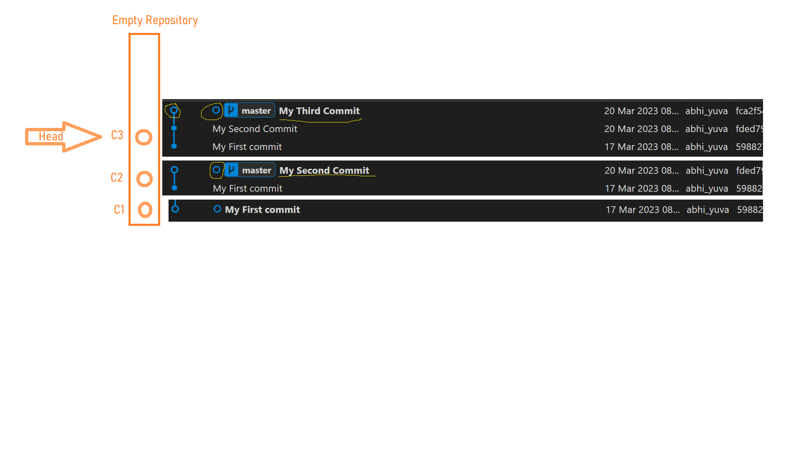
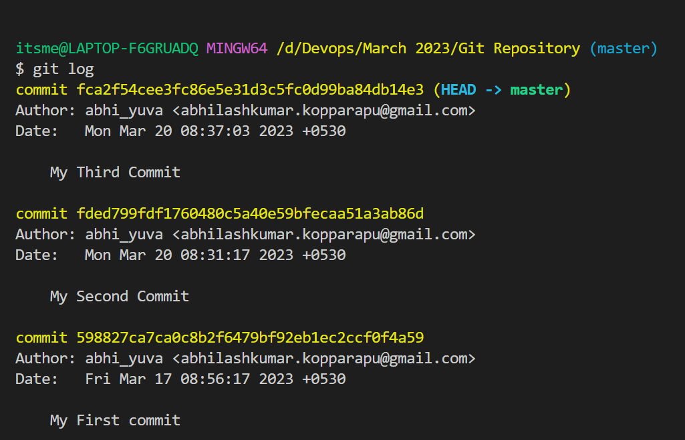
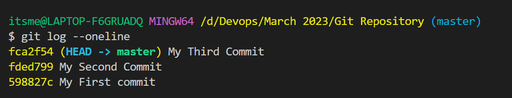
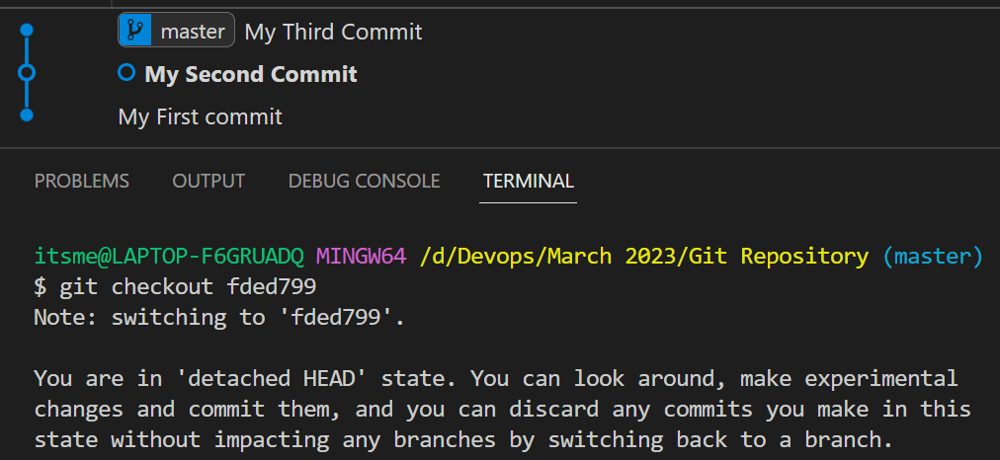
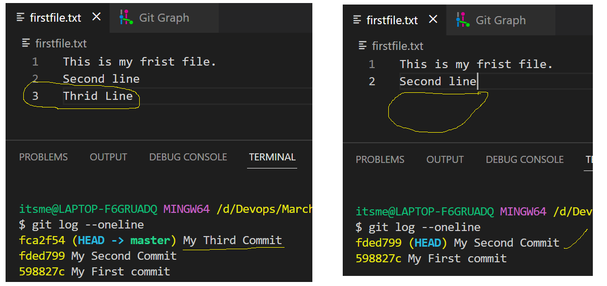

When ever we are creaing any repository by default a branch will created. The default branch name would be master. If you wnat you can modify the name of the branch.

**What is the use of branch**
The Branches in Git is similar to the repository for each persion. We have to create a branch from our existing branch where it will reflect all the changes fromt he branch which you are going to create.

**Branching Strategy**
- Main/Master
- dev
- uat
- stg
- prod
- hotfix
- feature - name of the devloper/ feature/

- When ever you are creating any commits, the commit will contain the following things
    - Commit ID
    - Commit Message
    - Author Details
    - Time & Date
- When a new commit is created *Head* will be pointing to the latest commit.
- If you want to go to the previous commit we have to change the head position.
- When ever you are chaing the branch for each branch head will be moved to the current branch where ever you are working
- For every branch individual HEAD will be created by default.



**Git Log**
```
git log
```
Git log is used to preview the commits in current branch. It will give you all the details briefly on every commit along with the HEAD position.


```
git log --oneline
```
This command gives you short description of all the commits in a single line.


**Git Checkout**
```
git checkout <branch-name> / <commit-id>
```
This command is used to move the Head position from current to another position if we use commit id.
If we use the branch name, it is used to move from one branch to another branch.


- Along with the head position the content will also change.\
