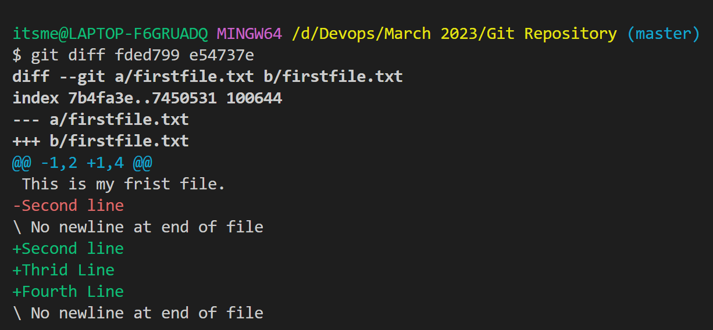
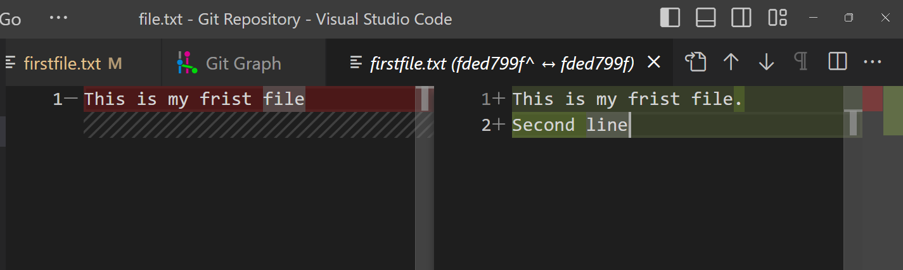
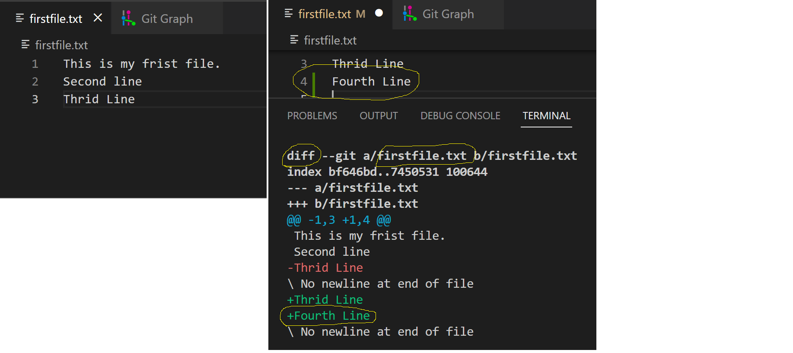
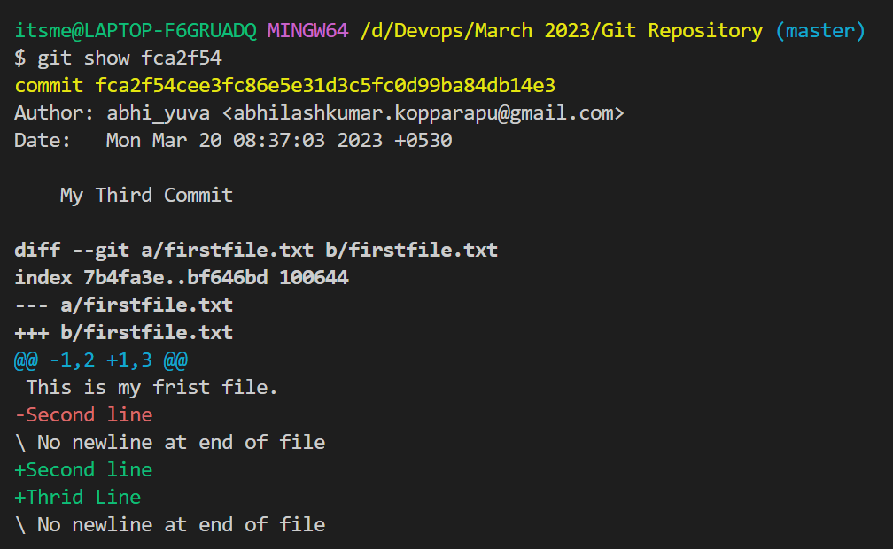

## Git Commands

# How to check the changes in Git.
- When ever you are doing any commits, as we are aware that there will few changes happen from once commit to another commit.
- Now if you want to see the changes from/between commits we have to follow the below strategy.
- There are two way to check the differences
    - First One: from Commits.
        - We can see the changes between two or more commits in two ways
             1) By Using commandline
                ```
                git diff <commit1> <commit2>
                ```
                ```
                itsme@LAPTOP-F6GRUADQ MINGW64 /d/Devops/March 2023/Git Repository (master)
                $ git diff 598827c fded799
                diff --git a/firstfile.txt b/firstfile.txt
                index b49b128..7b4fa3e 100644
                --- a/firstfile.txt
                +++ b/firstfile.txt
                @@ -1 +1,2 @@
                -This is my frist file
                \ No newline at end of file
                +This is my frist file.
                +Second line
                \ No newline at end of file
                ```
                For Multiple commits
                
             2) From Graph in Visual Studio
            
             3) From Git Hub Repository
    - Second one: Changes before doing commit.
        ```
        git diff
        ```
        
# How to see the details of each commit.
- Git Show command will gives the complete information about a particular commit along with the commit meta data and the differences in the commit.
- Git show will give details about only a single commit.
```
git show <commit-id>
```


# Indepth details of a Particualr commit
- There is somithing resided inside of a commit.
- Which will contain the details as below
    - Parent of the current commit
    - Author of the commit
    - Structure of the commit
- For this to go indeeper we have use the following command
```
git cat-file <options> <commit-id>
```
```
itsme@LAPTOP-F6GRUADQ MINGW64 /d/Devops/March 2023/Git Repository (master)
$ git cat-file -s fca2f54
254

itsme@LAPTOP-F6GRUADQ MINGW64 /d/Devops/March 2023/Git Repository (master)
$ git cat-file -t fca2f54
commit

itsme@LAPTOP-F6GRUADQ MINGW64 /d/Devops/March 2023/Git Repository (master)
$ git cat-file -p fca2f54
tree 846cc7b135830494ffbc00e47758a2e38cf128f6
parent fded799fdf1760480c5a40e59bfecaa51a3ab86d
author abhi_yuva <abhilashkumar.kopparapu@gmail.com> 1679281623 +0530    
committer abhi_yuva <abhilashkumar.kopparapu@gmail.com> 1679281623 +0530 

My Third Commit


$ git cat-file -p fca2f54
tree 846cc7b135830494ffbc00e47758a2e38cf128f6
parent fded799fdf1760480c5a40e59bfecaa51a3ab86d
author abhi_yuva <abhilashkumar.kopparapu@gmail.com> 1679281623 +0530    
committer abhi_yuva <abhilashkumar.kopparapu@gmail.com> 1679281623 +0530 

My Third Commit

itsme@LAPTOP-F6GRUADQ MINGW64 /d/Devops/March 2023/Git Repository (master)
$ git cat-file -p 846cc7b1358
100644 blob bf646bd40d2a2d08f0dca393fac907ec184a76b5    firstfile.txt

```
