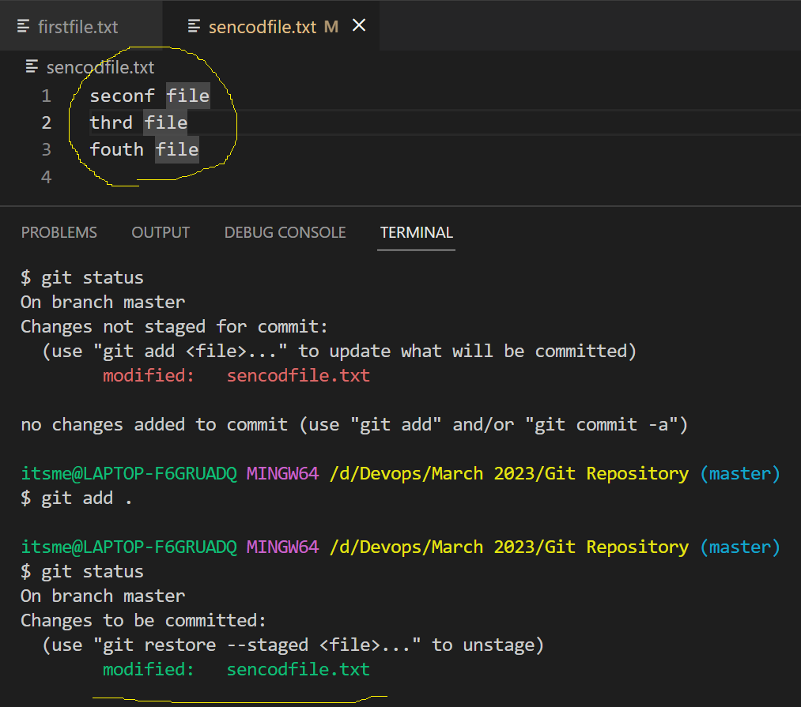
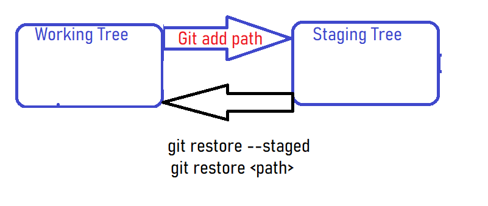
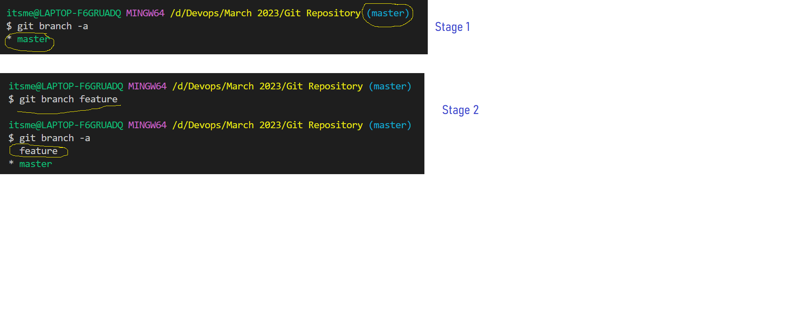
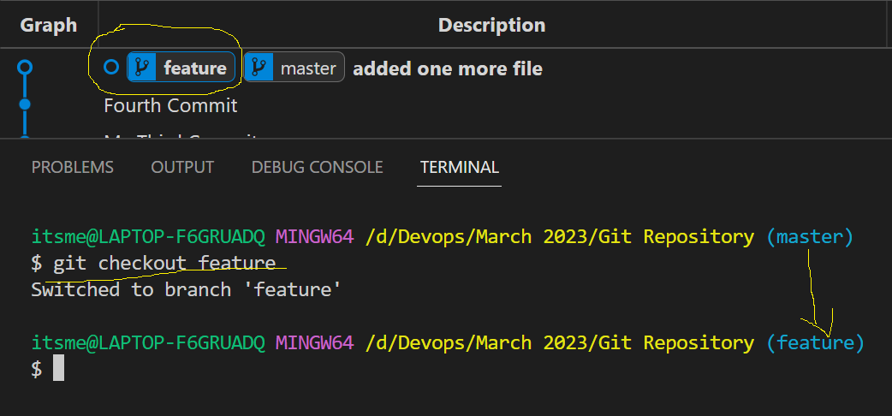
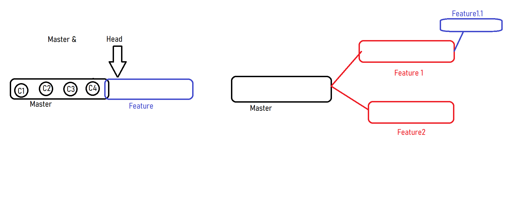
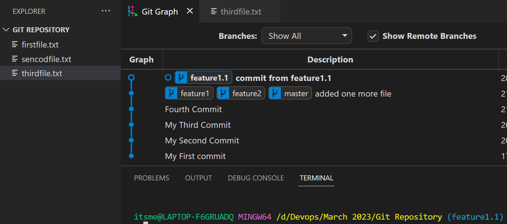
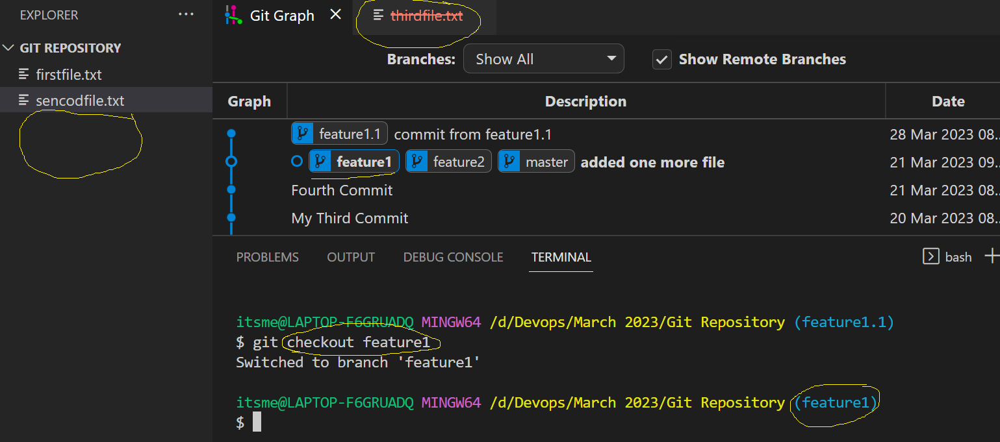
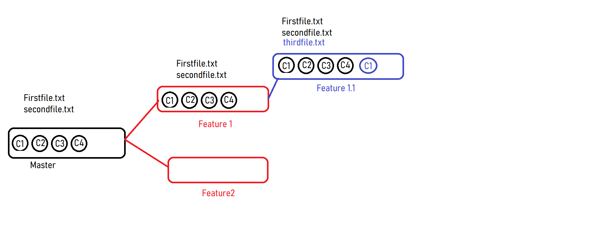
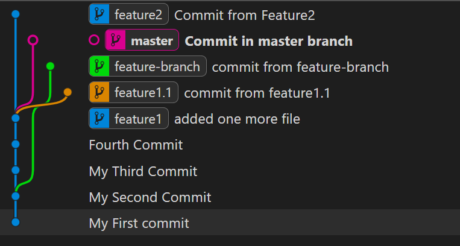

### My Scenrio:


## Git Restore:
Git Restore is to undo your changes from either statging area or from working tree. It will move back all your changes from staging area to working tree or will completely remove from your working tree.

```
git restore --stage --> Moves back to working tree
git restore <path>  --> completely removes the changes from working tree.
```

Be cautious while performing git restore. Becuase it will remove all the changes from your working tree till to the previous commit.



## Head & Branch
- For every branch a head will pointing to the lates commit. When ever you move the changes or create a new branch head position will change accordingly.
- Now if you want to create a new branch, below is the command.

```
git branch <branch_name>
git checkout <branch_name>
git checkout -b <branch_name>
```







