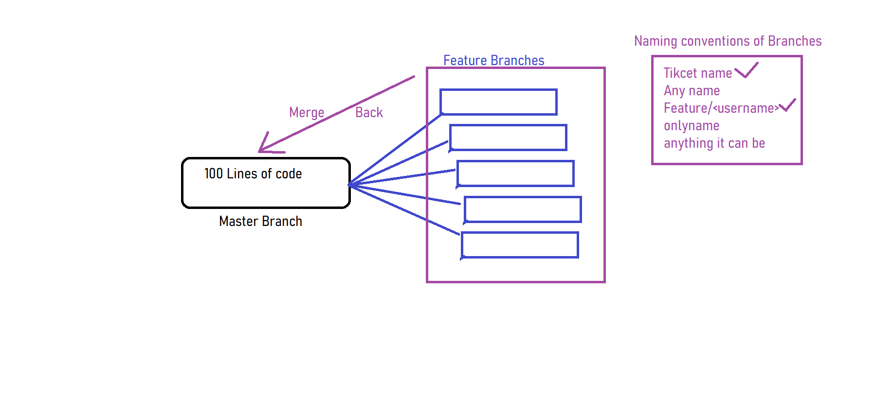
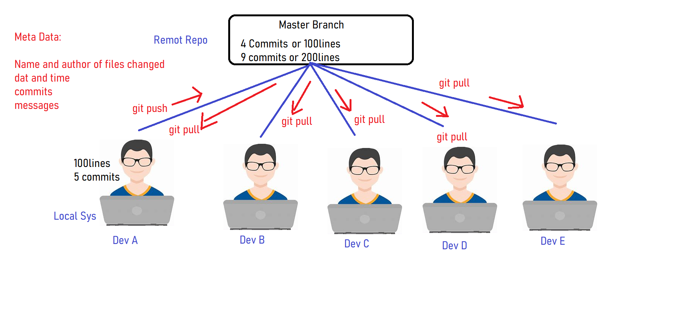
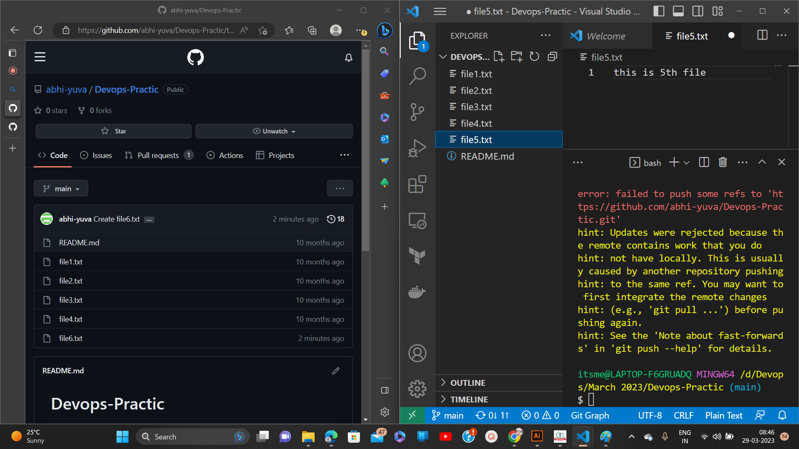
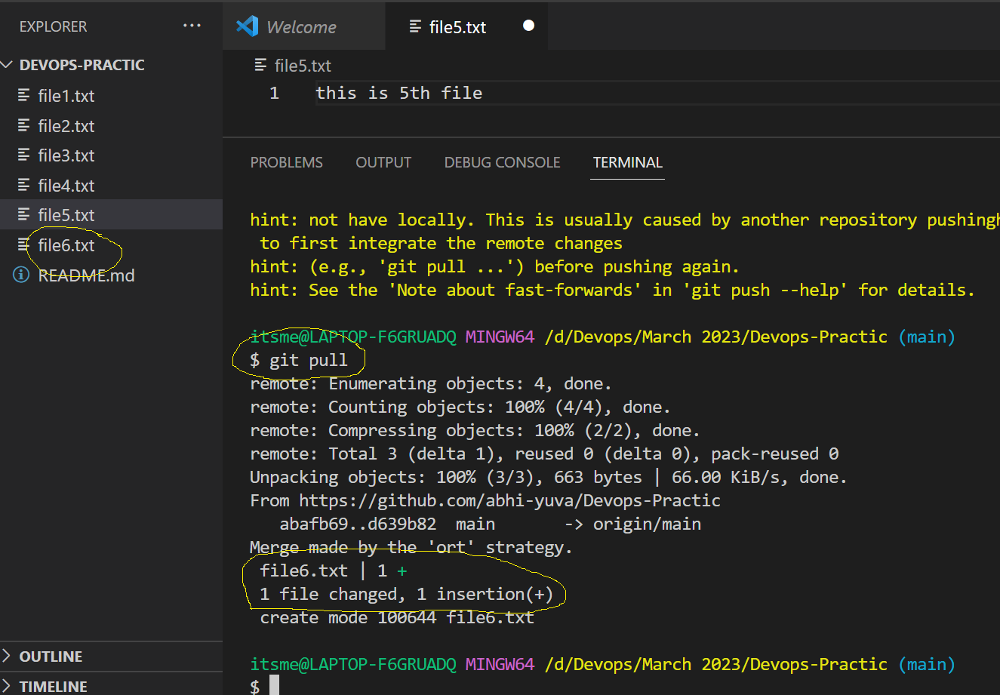
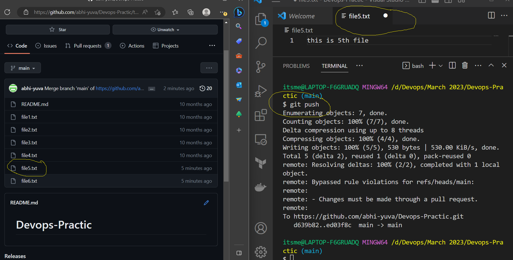

## How to work on Repository

## Way to merge back the changes to master branch
- There are 3 ways where you can merge back the changes from your feature branches to the stable branch
    - Merge
    - Rebase
    - Cherry Pick
- When ever you try to merge the changes, you may get merge conflicts which need to resolved by the developers.
- keep in mind that all the changes will be approved by the author before merging the changes to the stable branch.
- The good idea is to pull the changes from the remote repository to your local system when you are ready to push back the changes back to remote repo from your local system.

